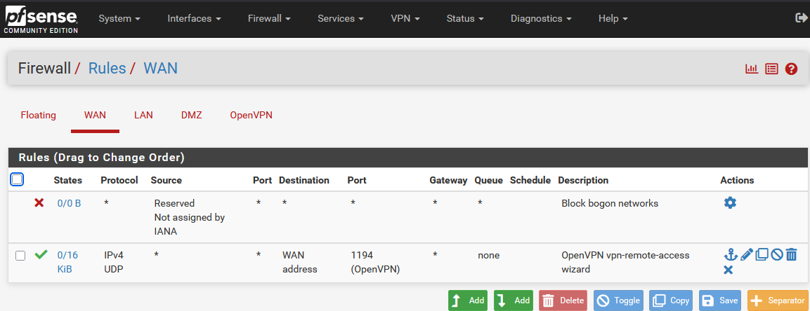
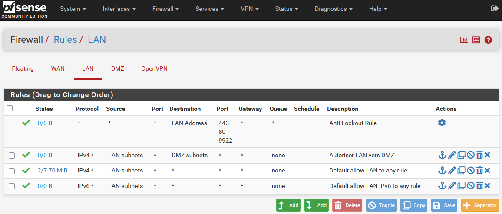
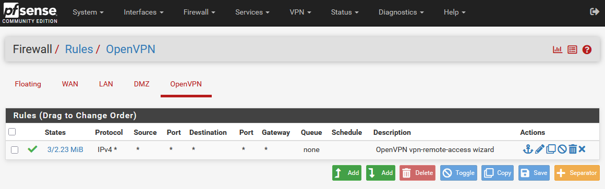

# Firewall Rules

L’ensemble du filtrage est centralisé sur pfSense.  
La politique appliquée repose sur le principe : **autoriser uniquement ce qui est nécessaire**.

---

## WAN Rules

| Action | Protocol | Source | Destination | Port | Description |
|--------|----------|--------|------------|------|------------|
| Block  | *        | Bogon networks | Any | * | Block bogon networks |
| Allow  | UDP      | Any    | WAN address | 1194 | OpenVPN remote access |

### Current WAN Configuration

---

## LAN Rules

| Action | Protocol | Source | Destination | Description |
|--------|----------|--------|------------|------------|
| Allow  | *        | LAN address | 443, 80, 9922 | Anti-lockout rule |
| Allow  | IPv4     | LAN subnets | Any | Default allow LAN to any |
| Allow  | IPv6     | LAN subnets | Any | Default allow LAN IPv6 |

### Current LAN Configuration

---

## OpenVPN Rules

| Action | Protocol | Source | Destination | Description |
|--------|----------|--------|------------|------------|
| Allow  | IPv4     | Any | Any | OpenVPN remote-access wizard |

### Current OpenVPN Configuration

