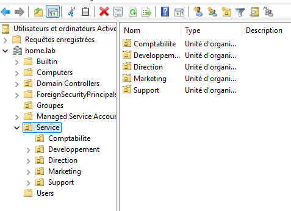
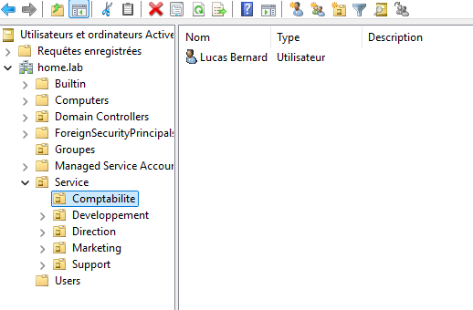

# 🏗️ – Active Directory

## 🎯 Objectif

Mettre en place un domaine Active Directory structuré afin de :

- Centraliser l’authentification
- Organiser les utilisateurs par service
- Gérer les groupes métiers
- Préparer les ACL du File Server
- Déployer des GPO ciblées
- Intégrer l’authentification VPN via RADIUS

---

# 🌐 Création du domaine

| Élément | Configuration |
|----------|---------------|
| Domaine | homelab.local |
| Type | Nouvelle forêt |
| DNS | Intégré à AD |
| Global Catalog | Activé |
| Niveau fonctionnel | Windows Server 2016+ |

---

# 🗂️ Structure Organisationnelle (OU)

Structure actuelle mise en place :

```
homelab.local
│
├── OU=Groups
│   ├── Comptabilite
│   ├── Developpement
│   ├── Direction
│   ├── Marketing
│   └── Support
│
└── OU=Service
    ├── Comptabilite
    ├── Developpement
    ├── Direction
    ├── Marketing
    └── Support
```

---

# 🖼️ Captures de la structure

## 📂 Organisation des services



---

## 👥 Groupes de sécurité


---

## 👤 Exemple utilisateur



---

# 👥 Groupes de sécurité

Des groupes globaux de sécurité ont été créés pour chaque service.

| Groupe | Type | Rôle |
|--------|------|------|
| Comptabilite | Global / Security | Accès ressources comptables |
| Developpement | Global / Security | Accès ressources développement |
| Direction | Global / Security | Accès ressources sensibles |
| Marketing | Global / Security | Accès communication |
| Support | Global / Security | Accès support technique |

---

# 👤 Comptes utilisateurs

Les utilisateurs sont placés dans leur OU métier correspondante.

Exemple :

- Lucas Bernard → OU=Comptabilite

Convention de nommage appliquée :

```
prenom.nom
```

Bonnes pratiques appliquées :

- Mot de passe complexe
- Changement au premier logon
- Compte admin séparé du compte utilisateur standard

---

# 🧠 Logique d’attribution des droits

Modèle appliqué :

AGDLP

```
Account → Global Group → Domain Local Group → Permissions
```

Dans le lab actuel :

- L’utilisateur est membre de son groupe métier
- Le groupe métier sera utilisé pour les ACL du File Server
- Les GPO pourront être ciblées par OU ou groupe

---

# 🔐 Sécurisation appliquée

- DNS intégré et contrôlé
- Administration limitée au LAN
- Compte Administrator non utilisé pour les tâches quotidiennes
- Séparation logique des services

---

# 🔄 Intégration dans l’infrastructure

Active Directory est utilisé pour :

- Authentification des postes clients
- Gestion des accès File Server
- Authentification VPN via RADIUS
- Déploiement des stratégies GPO

Il constitue le cœur de l’infrastructure interne sécurisée.

---

# 📌 Résultat

Le domaine est opérationnel :

- Résolution DNS interne fonctionnelle
- OU structurées
- Groupes métiers créés
- Utilisateurs organisés
- Architecture prête pour GPO et ACL

Cette configuration sert de base à la suite du projet (GPO, File Server, VPN sécurisé).
