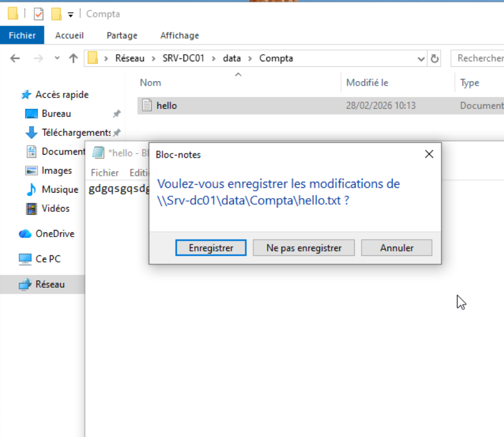
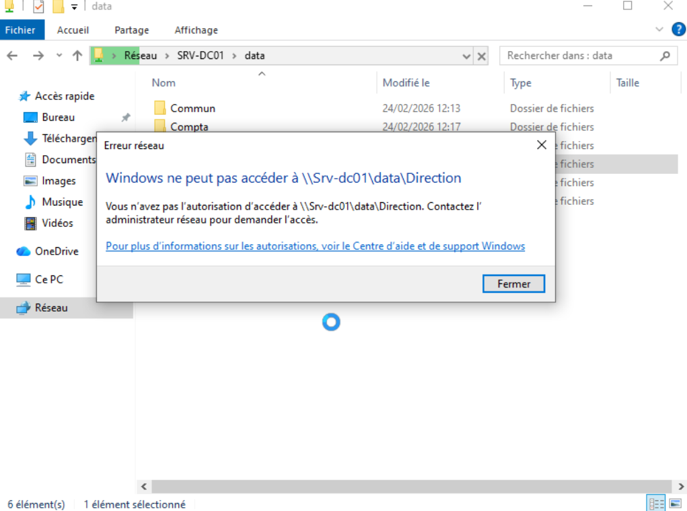

## File Server

## 🎯 Objectif

Mettre en place un serveur de fichiers centralisé avec :

- Partage réseau SMB
- Segmentation par service
- Gestion des droits via groupes Active Directory
- Isolation des accès entre services

---

## 🗂 Architecture des dossiers

Disque utilisé : D:

D:\DATA
├── Commun
├── Compta
├── Direction
├── Marketing
└── Support

---

## 🌐 Partage réseau

Partage configuré :

\\SRV-DC01\DATA

Partage avancé activé :
- Nom du partage : DATA
- Utilisateurs authentifiés : Lecture (partage)
- Droits NTFS gérés finement par service

---

## 🔐 Gestion des permissions

### Principe appliqué

- Les droits sont attribués aux groupes AD
- Les utilisateurs héritent des permissions via leur groupe métier
- Aucun droit direct attribué à un utilisateur

---

## 📌 Exemple : Service Comptabilité

### Groupe AD
Comptabilite

### Dossier
D:\DATA\Compta

### Permissions NTFS
- Groupe Comptabilite : Lecture / Écriture
- Autres groupes : Aucun accès

---

## ✅ Accès autorisé

Utilisateur membre du groupe Comptabilite :

Peut :
- Ouvrir les fichiers
- Modifier les fichiers
- Créer des fichiers

Illustration :

---

## ❌ Accès refusé

Tentative d’accès au dossier Direction :

Windows affiche :

Accès refusé – autorisation insuffisante

Illustration :

---

## 🧠 Bonnes pratiques appliquées

- Séparation Partage / NTFS
- Droits minimaux (principe du moindre privilège)
- Attribution via groupes AD uniquement
- Structure claire et évolutive
- Centralisation des données sur un volume dédié

---

## 🔐 Sécurité

- Aucun accès anonyme
- Pas de droits "Tout le monde"
- Accès contrôlé par groupe métier
- Structure prête pour sauvegarde centralisée
