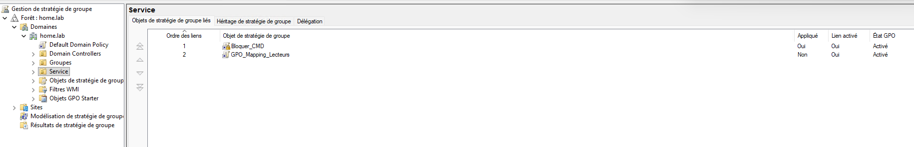
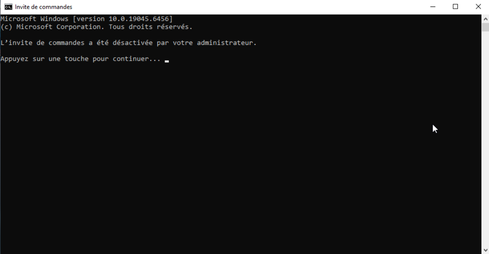

# - Group Policy Objects (GPO)

## 🎯 Objectif

Mettre en place des stratégies de groupe afin de :

- Restreindre certaines fonctionnalités Windows
- Appliquer des règles de sécurité
- Centraliser la gestion des postes utilisateurs
- Préparer le mappage automatique des lecteurs réseau

---

## 📦 Prérequis

Avant la création des stratégies de groupe, les éléments suivants doivent être installés :

- Rôle Active Directory Domain Services (AD DS)
- DNS intégré
- Console Group Policy Management (GPMC)

La gestion des GPO est réalisée via la console :

Server Manager → Tools → Group Policy Management

Les postes clients doivent être :

- Membres du domaine
- Redémarrés après intégration
- Connectés au réseau interne

---

# 🧱 GPO – Blocage de l’invite de commande

## 📌 Nom de la GPO
Bloquer_CMD

## 📍 Lien
OU = Service

---

## ⚙️ Paramétrage

Chemin de configuration :

User Configuration  
→ Policies  
→ Administrative Templates  
→ System  
→ Prevent access to the command prompt  

Paramètre activé :

Enabled  
Option : Disable the command prompt script processing (si souhaité)

---

## 🖼️ Capture de la GPO



---

## 🧪 Test de validation

Sur un poste client membre du domaine :

```
gpupdate /force
```

Ouverture de session utilisateur ciblé.

Résultat :



Message affiché :

"L’invite de commandes a été désactivée par votre administrateur."

---

# 🧠 Logique d’application

La GPO est liée à l’OU Service.

Elle s’applique donc :

- Aux utilisateurs présents dans Service
- Aux sous-OU (Comptabilite, Support, etc.)
- Sauf héritage bloqué

---

# 🔐 Intérêt sécurité

Le blocage de l’invite de commandes permet de :

- Limiter l’exécution de commandes non autorisées
- Réduire les risques de scripts malveillants
- Restreindre les actions utilisateurs standards

---

# 📌 Conclusion

La stratégie GPO est fonctionnelle et validée.

Elle démontre :

- Maîtrise du ciblage par OU
- Compréhension de l’héritage
- Capacité de test et validation
- Mise en œuvre de restrictions sécurité poste

