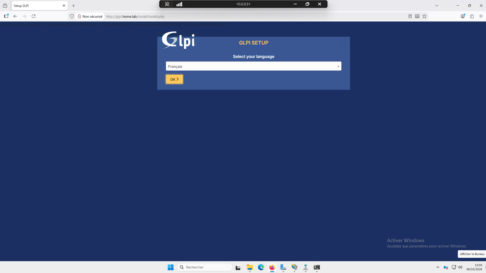

# GLPI – Gestion de parc et support IT

## Présentation

**GLPI** est une solution open source de gestion des services informatiques (ITSM).  
Elle permet de centraliser la gestion d’un parc informatique, le support utilisateur et le suivi des incidents via un système de tickets.

Dans un environnement professionnel, GLPI est souvent utilisé pour :

- gérer les **tickets de support**
- suivre les **incidents** et les **demandes utilisateurs**
- inventorier le **parc informatique**
- centraliser les **utilisateurs** et les **équipements**
- améliorer le **suivi** et la **traçabilité** des interventions

GLPI peut également s’intégrer à un annuaire **LDAP / Active Directory** afin de réutiliser les comptes existants de l’infrastructure.

---

## Intégration dans le homelab

Dans ce homelab, GLPI est déployé pour simuler un **outil de support IT d’entreprise**.  
Il permet de reproduire un workflow réaliste de gestion des incidents et des demandes utilisateurs.

---

## Architecture de déploiement

Dans ce lab, **GLPI est installé sur une machine virtuelle Ubuntu dédiée**.

Le service fonctionne sur une pile web classique :

- Apache
- PHP
- MariaDB

Le serveur GLPI est séparé du **Windows Server**, qui reste dédié aux rôles d’infrastructure :

- Active Directory
- DNS
- DHCP
- gestion des utilisateurs

Cette séparation permet de reproduire une **architecture plus réaliste**, où les services applicatifs sont isolés des contrôleurs de domaine.

---

## Captures

### Interface d’installation

  

### Exemple de ticket

  

### Ajout / synchronisation d’utilisateurs

  

---

## Conclusion

GLPI ajoute au homelab une composante orientée **support**, **suivi des incidents** et **gestion des utilisateurs**.  
C’est une solution pertinente pour illustrer un environnement IT plus proche d’un contexte professionnel, en complément des services d’infrastructure déjà déployés.
